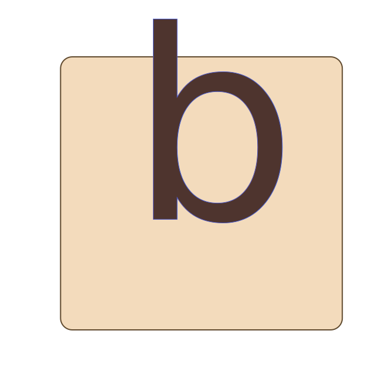

# [](assets/badreads.svg)    
   

### Build and run from source
To build and run badreads from source, you have to install some dependencies:

#### build dependencies
- git
- clang(or gcc)

After that, clone the repo:
`git clone https://github.com/LinArcX/badreads/`

And cd to cloned directory and compile the project with make:

```
cd badreads; mkdir build; cd build
make
cd ../build_tools/make/Release; ./badreads
```

## License

